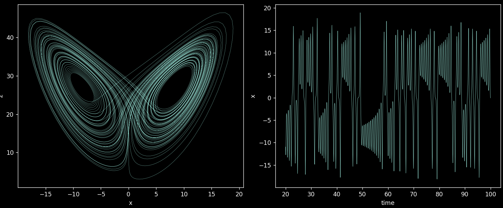
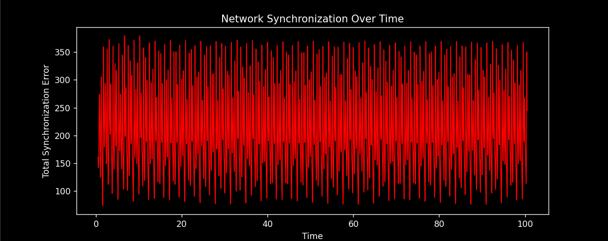
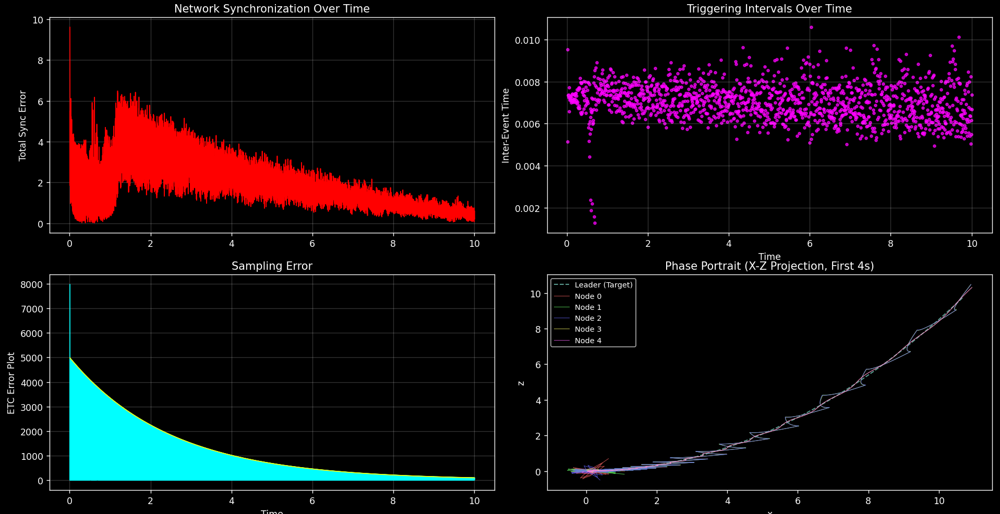
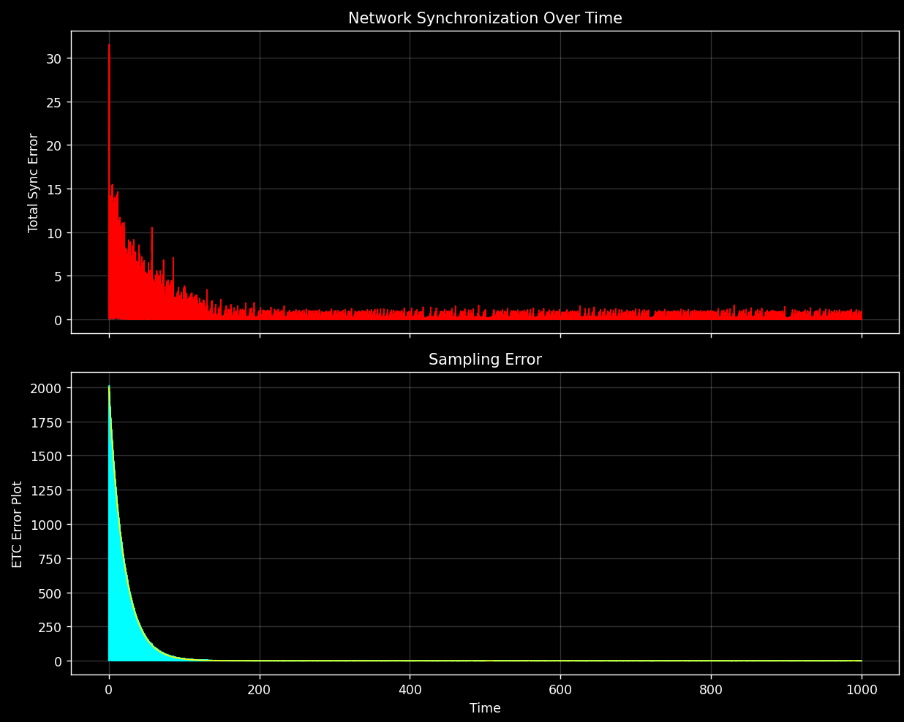

---

## Simulation of ETC for Pinning Synchronization for Nodes Under Lorenz Dynamics with Coupling Delays
*Coded in python with numpy$^{[1]}$, matplotlib$^{[2]}$ and jitcdde$^{[3]}$.*

---

The goal is to develop a simulation for a synchronization network under event triggered pinning control. For the internal chaotic dynamics we will use the lorenz system with our system bounded within the attractor to obtain the Lipchitz and OSL coefficients we need for the result being applied.

Imports
```python
import numpy as np
import matplotlib as plt
import jitcdde as dde, y, t
```

### Version 1: Uncontrolled Node ===
The first objective is to simulate one node under Lorenz dynamics. 

Defining the Lorenz dynamics: 

$$
f(x,y,z) = \begin{cases} \dot x =  \sigma(x -y) \\  \dot y =x( r - z) - y \\ \dot z = xy - bz \end{cases}
$$

With $\sigma  = 10, \quad  r = 28, \quad b = 8/3$: 

Implementing that in code following the jitcdde conventions:
```py
sigma, r, b = 10.0, 28.0, 8.0/3.0

f = [
sigma*(y(1)- y(0)),
y(0)*(r - y(2)) - y(1),
y(0)*y(1) - b*y(2)
]

DDE = jitcdde(f)
```

Configuration of our DDE object 
```py
DDE.set_integration_parameters(rtol=1e-6, atol=1e-9)
DDE.constant_past([1.0, 1.0, 1.0])
DDE.step_on_discontinuities()
```

Creating a sampling subsequence of integration steps, collecting the data, and dropping the transient behaviour
```py
times = np.arange(DDE.t, DDE.t + 200, 0.5)
results = [DDE.integrate(time) for time in times]
data = data[2000:]     
```

Plotting the data set with matplotlib. The first plot is the phase portrate, $x$ versus $z$ over all time. The second is the time series, this plots a single variable $x$ over the time steps.
```py
fig, (ax1, ax2) = plt.subplots(1, 2, figsize=(12, 5))

ax1.plot(data[:, 0], data[:, 2], lw=0.3)
ax1.set_xlabel("x")
ax1.set_ylabel("z")

ax2.plot(times[2000:], data[:, 0], lw=0.5)
ax2.set_xlabel("time")
ax2.set_ylabel("x")

plt.tight_layout()
np.save("lorenz_reference.npy", data)
plt.show()
```

#### Results: 
The following is the plots that were created: This suggests that the integration is working as expected and the dynamics are defined correctly.

### Plan for Moving Forward ===
There are a few things that need to be done before moving into the next version. 

##### The Ideal Architecture
This is the ideal architecture for how the simulation is configured:

###### Free Specs
Number of nodes $(n)$
Inner coupling matrix $(\Gamma)$
Outer coupling matrix $(A)$ 
Coupling strength $(c)$ 
Lorenz coefficents $(\sigma, b, r)$
Target solution $(z(t))$

Which give the derived spacs:

###### Derived Specs
Lipchitz coefficient $(L)$
OSL coefficent $(\gamma)$ 
ETC subsequence $(t_{ik})$

Then choose values for the restricted specs:

###### Restricted Specs
Maximum delay $(\tau_0)$
Minimum control strength $(\bar d_{\min})$

Then it is run and the results are plotted. 

##### Lipchtz Coeffs
First we need a way to compute the Lipchitz coefficients based on the dynamics for a node. There actually is only one $f$ therefore there is only one $L$ and $\gamma$. Regardless these depend on the choice of $\sigma, d, r$ so it needs to be done generically. (Version 2)

##### Maximum Delay
We also need a way to compute the maximum delay which depends on the lipchitz.  (Version 2)

##### Control Strenght
We also need a way to compute the minimum control strenght fot the pinned nodes. (Version 3)

We will leave any kind of control for the third version. The second version will be the uncontrolled network.

### Version 2: Uncontrolled Network === 
In this version the goal is to create the larger uncontrolled system dynamics. Currently we have a single node:

$$
\dot x = f(x)
$$

Where $x \in \mathbb{R}^3$ and $f(x)$ is the Lorenz chaotic dynamics with coefficients $(\sigma, r, d)$. What we need however is:

$$
\dot x_i(t) = f(x_i(t)) + c \sum_{j=1}^N a_{ij} \Gamma x_j(t-\tau(t))
$$

We need to add a section where we input our network topology. In this version we also want to implement computation for the lipchitz coefficients and the maximum delay. Then we need to rewrite the Jitcdde system to be the network with delays. Finally we need to update the plots. 

The steps to simulate will be hard code topology, run, recieve premissable delay set, select a delay bound that is or is not within that bound, then the simulation will run. 

#### Setting the network topology
The following 5 fields describe the network topology 
```py
# Scalar
number_of_nodes = 5

# A square matrix with dimension equal to the dimension of each nodes state vector (3x3 for Lorenz)
inner_coupling_matrix = [
    [0,0,0]
    [0,0,0]
    [0,0,0]
]

# A square matrix with dimensions equal to the number of nodes
outer_coupling_matrix = [
    [0,0,0,0,0]
    [0,0,0,0,0]
    [0,0,0,0,0]
    [0,0,0,0,0]
    [0,0,0,0,0]
]

# A single scalar
coupling_strength = 1

# A triple of sigma, r, b
lorenz_coefficients = [0,0,0]
```

#### Computing Lipchitz Coefficents
We will generically compute the lipchitz coefficents, first with math and then in code. Take an arbtrary triple of positive constants $(\sigma,r,b)$ that define a Lorenz system:

$$
f(x,y,z) = \begin{cases} \dot x =  \sigma(y-x) \\  \dot y =x( r - z) - y \\ \dot z = xy - bz \end{cases}
$$

##### Restricting to an Invariant Subset
Restrict to a subset of the state space that is invariant and thus lipchitz, more specifically:

Consider the Lyapunov function:

$$
V = x^2 + y^2 +(z-r- \sigma)^2
$$

Differentiating along the flow:

$$
\begin{aligned}
&\dot V = 2x \dot x + 2y \dot y + 2\dot z(z - r - \sigma) \\
&= 2x (\sigma(y-x)) + 2y (x( r - z) - y) + 2 (xy - bz)(z - r - \sigma) \\
&=-2\sigma x^2 -2y^2 -2b(z - (r + \sigma)/2)^2 + 2b((r+ \sigma)/2)^2
\end{aligned}
$$

The first three terms are negative definite; the whole expression turns negative once you are far enough out. So for sufficienly large $(x,y,z)$:

$$
\sigma x^2 + y^2 + b(z - (r + \sigma)/2)^2\gt b((r+ \sigma)/2)^2
$$

Implying that when this is true the Lyapunov derivative is strictly negative, so the following set definition is invariant with respect to the solutions of the Lorenz function:

$$
E := \{x,y,z \in \mathbb R : \sigma x^2 + y^2 + b(z - (r + \sigma)/2)^2 \le b((r+ \sigma)/2)^2\}
$$

So as long as the initial conditions are in $E$, we know that the solutions never leave $E$. Thus we can find the Lipchitz coefficients on the set $E \subset \mathbb R^3$. Furthermore we have convexity making numerical methods effective and the geometry allows us to be certain that the value of interest is on the elipsoids surface meaning we only need to search this 2d region with the numerics. *Proof to support this?*

##### Numerics for Computing Coefficients
Mesh over the outer set boundary, and brute forcing point to point comparisons keeping the maximum.
```py
def ellipsoid_params(sigma, r, b):
    c = (r + sigma) / 2
    a_x = c * np.sqrt(b / sigma)
    a_y = c * np.sqrt(b)
    a_z = c
    return c, a_x, a_y, a_z

def boundary_point(phi, theta, sigma, r, b):
    c, a_x, a_y, a_z = ellipsoid_params(sigma, r, b)
    x = a_x * np.sin(phi) * np.cos(theta)
    y = a_y * np.sin(phi) * np.sin(theta)
    z = c + a_z * np.cos(phi)
    return np.array([x, y, z])

def jacobian(state, sigma, r, b):
    x, y, z = state
    return np.array([
        [-sigma, sigma,  0.0],
        [ r - z,  -1.0,   -x],
        [    y,      x,   -b]
    ])

def lipschitz_constant(params, n_grid=300):
    sigma, r, b = params
    phis   = np.linspace(0, np.pi,   n_grid)
    thetas = np.linspace(0, 2*np.pi, n_grid)
    best = -np.inf
    for phi in phis:
        for theta in thetas:
            state = boundary_point(phi, theta, sigma, r, b)
            J = jacobian(state, sigma, r, b)
            val = np.linalg.norm(J, 2)
            if val > best:
                best = val
    return best

def osl_constant(params, n_grid=300):
    sigma, r, b = params
    phis   = np.linspace(0, np.pi,   n_grid)
    thetas = np.linspace(0, 2*np.pi, n_grid)
    best = -np.inf
    for phi in phis:
        for theta in thetas:
            state = boundary_point(phi, theta, sigma, r, b)
            J = jacobian(state, sigma, r, b)
            J_sym = 0.5 * (J + J.T)
            val = np.max(np.linalg.eigvalsh(J_sym))
            if val > best:
                best = val
    return best
```

#### Computing Maximum Permissable Delay
The following is a function that computes the maximum permissable delay based on the Lipchitz coefficents that we discovered are valid globally on $E$. The delay max is given by:

 $\omega_{ij} = \|\Omega_{ij}\| = c\| A_{ij} \otimes \Gamma\|$, $\mu= \lambda_{\max}(\Omega^s_{22}) = \lambda_{\max}(\frac{1}{2}(\Omega_{22}^\top + \Omega_{22}))$

$$
\tau_{\max} = \frac{- \mu -\gamma - \omega_{21}}{\omega_{22}(L + \omega_{22}+ \omega_{21})}
$$

Writing this as a code function:
```py
'''
Takes in the network topology and the computed OSL and Lipchitz coefficents, and computes what the theorem calls the maximum premissable delay 
that will still allow for synchronization.
'''
def compute_tau_max(A, L, rho, Gamma, c, l): 
    A = np.array(A)
    Gamma = np.array(Gamma)
    A22 = A[l:, l:]       
    A21 = A[l:, :l]        

    Omega22 = c * np.kron(A22, Gamma)
    Omega21 = c * np.kron(A21, Gamma)
    omega21 = np.linalg.norm(Omega21, 2)           
    omega22 = np.linalg.norm(Omega22, 2)           

    Omega22_sym = 0.5 * (Omega22 + Omega22.T)
    mu = np.max(np.linalg.eigvalsh(Omega22_sym))   

    numerator   = -mu - rho - omega21
    denominator = L + omega22 + omega21           

    tau_max = numerator / denominator
    return tau_max
```

#### Networked Systems With Delay Coupling
We need to develop a statement for each element of the state vector of node $i$, then append for each $i$ these three items to one global list, then node $1$ will be $y(0), y(1), y(2)$ and node $i$ will be $y(i), y(i+1), y(i+2)$.

$$
\dot x_i(t) = f(x_i(t)) + c \sum_{j=1}^N a_{ij} \Gamma x_j(t-\tau(t))
$$

For node $i$ of the lorenz system with $n=3$:

$$
\begin{bmatrix} \dot x_{i1} \\ \dot x_{i2} \\ \dot x_{i3} \end{bmatrix} = \begin{bmatrix} f_1 \\ f_2 \\ f_3  \end{bmatrix} 
+ c \sum_{j=1}^N a_{ij} 
\begin{bmatrix} \Gamma_{11} & \Gamma_{12} & \Gamma_{13} \\ \Gamma_{21}& \Gamma_{22} & \Gamma_{23} \\ \Gamma_{31} & \Gamma_{32} & \Gamma_{33} \end{bmatrix}
\begin{bmatrix} x_{j1} \\ x_{j2} \\ x_{j3} \end{bmatrix}
$$

So system $i$ as scalar equations:

$$
\begin{aligned}
&\dot x_{i1} = f_1 + c \sum^N_{j=1} a_{ij} (\Gamma_{11}x_{j1} + \Gamma_{12}x_{j2} + \Gamma_{13}x_{j3}) \\
&\dot x_{i2} = f_2 + c \sum^N_{j=1} a_{ij} (\Gamma_{21}x_{j1} + \Gamma_{22}x_{j2} + \Gamma_{23}x_{j3}) \\
&\dot x_{i3} = f_3 + c \sum^N_{j=1} a_{ij} (\Gamma_{31}x_{j1} + \Gamma_{32}x_{j2} + \Gamma_{33}x_{j3}) \\
\end{aligned}
$$

Formulating the system equation with python:
```py
'''
Building out the network dynamical system formula f, in the format desired by Jitcdde. 
'''
f = []
for i in range(n):
    
    sums = [] 
    for states in range(0,N):
        sums.append(0.0)
    
    for v in range(N): 
        coupling_term = 0.0
        
        for j in range(n):
            inner_prod = (Gamma[v][0] * y(idx(j, 0), t - tau) +
                          Gamma[v][1] * y(idx(j, 1), t - tau) +
                          Gamma[v][2] * y(idx(j, 2), t - tau))
            
            coupling_term += A[i][j] * inner_prod
        sums[v] = c * coupling_term

    xi = y(idx(i, 0), t)
    yi = y(idx(i, 1), t)
    zi = y(idx(i, 2), t)
    
    dx = sigma * (yi - xi) + sums[0]
    dy = xi * (r - zi) - yi + sums[1]
    dz = xi * yi - b * zi + sums[2]
    
    f.extend([dx, dy, dz])
```

#### Plotting Network Results
I am opting for a simple sychronization error function over time.
```py
'''
Computing the total sychronization error at each time in the times subsequence
'''
def compute_sync_error(data, num_nodes, vars_per_node):
    time_steps = data.shape[0]

    reshaped_data = data.reshape(time_steps, num_nodes, vars_per_node)
    error_over_time = np.zeros(time_steps)
    
    for j in range(num_nodes):
        for k in range(j + 1, num_nodes):
            diff = reshaped_data[:, j, :] - reshaped_data[:, k, :]
            dist = np.linalg.norm(diff, axis=1)
            error_over_time += dist
            
    return error_over_time
    
'''
Synchronization error over time plot
'''
def plot_sync_error(sync_error, plot_times):
    fig_err, ax_err = plt.subplots(figsize=(10, 4))
    ax_err.plot(plot_times, sync_error, color='red', lw=1.0)
    ax_err.set_xlabel("Time")
    ax_err.set_ylabel("Total Synchronization Error")
    ax_err.set_title("Network Synchronization Over Time")
    plt.show()
```

#### Results of Version 2 
Lipchitz: 34.78218562695248 | OSL: 14.293071181469571 | Maximum delay: -0.3592832056915947Evidently the network did not sychronize. This should be expected since its a chaotic system and we havent yet added control, furthermore the theorem definelty does not give a guarintee that the system will stabilize here as conditions derived from the topology demand negative delay which is not possible.

### Version 3: Adding Control
The third and final stage of developing this simulation is to add the event triggered pinning control. Our control rule for pinned nodes where $D = \text{diag}[d_1,...d_l]$.

$$
u(t_k) = -D \hat e(t_k) \iff u_i(t_{ik}) = -d_i e_i(t_{ik}), \quad i =1,...l
$$

The following is our event triggered control rule:

$$
\begin{aligned}
&\text{ETC Sampling Error:} \quad \epsilon_i(t) :=  e_i(t) - e_i(t_k), \quad t \in [t_{ik}, t_{ik+1}), \quad \text{for } k\in \mathbb{N}  \\

& \text{Error Measure:} \quad \mathcal C_i (e_i(t), \epsilon_i(t)) := \bar d \|\epsilon(t)\| \| \hat e(t)\| \\

& \text{Event Threshold:} \quad \zeta := \alpha \exp({-\beta t}) \\

& \text{Event Subsequence:} \quad t_{ik+1} := \inf\{t_i \gt t_{ik} : \mathcal C_i(x_i(t),\epsilon_i(t)) \ge \zeta_i(t)\}
\end{aligned}
$$

And the conditions on minimal control strength:

$$
\bar d > \gamma + \omega_{11} + \omega_{21}
$$

Where $\bar d$ is the minimum over the set of control gains of all pinned nodes $d_i$.

To implement this we need to update the pinned node $(i = 1,...l)$ dynamics in the following way:

$$
f(t,x_i(t)) + c \sum_{j=1}^N a_{ij} \Gamma x_j(t-\tau(t))\quad  \to \quad f(t,x_i(t)) + c \sum_{j=1}^N a_{ij} \Gamma x_j(t-\tau(t))  - d_i  e_i(t)
$$

Where $e_i(t) := x_i(t) - z(t)$.

**Computing Minimal Control Strength**
The first thing to do is to develop a function that computes the results minimal control threshold based on the parameters of our system: $\bar d > \gamma + \omega_{11} + \omega_{21}$. In code:
```py
'''
Computing the minimum control gain required universally across all pinned nodes to satisfy the control strenght condition
'''
def minimal_control_strength(A, rho, Gamma, c, l):
    A = np.array(A)
    Gamma = np.array(Gamma)
    A11 = A[:l:, :l]        
    A21 = A[l:, :l]        

    Omega11 = c * np.kron(A11, Gamma)
    Omega21 = c * np.kron(A21, Gamma)
    omega21 = np.linalg.norm(Omega21, 2)           
    omega11 = np.linalg.norm(Omega11, 2)    

    return(rho + omega11 + omega21)
```

**Defining the control marix and pinned node Set**
We add now a control matrix which is $5 \times 5$ diagonal, the control gain for the $i$th node is found at $D_{ii}$ with $0$ appearing for the uncontrolled nodes. We also define a pinned node matrix which has a $1$ at $L_{ii}$ if node $i$ is controlled, and zero otherwise, it is also $5\times 5$ diagonal.

**Extracting minimum control gain**
This function takes the defined control matrix and determines the minimum non $0$ control gain.
```py
'''
Extracting the minimum control gain out of the control matrix
'''
def minimum_control_gain(D):
    num_nodes = len(D[0])

    # Locating the maximum value over the matrix
    min = 0
    for i in range(0, num_nodes):
        for j in range(0, num_nodes):
            if min <= D[i][j]:
                min = D[i][j]

    # Taking the minimum over all non zero matrix entries
    for i in range(0, num_nodes):
        for j in range(0, num_nodes):
            if min >= D[i][j] and D[i][j] != 0:
                min = D[i][j]
    return(min)
```

**Event Triggered Control Function**
We need a function that tracks the ETC error, determines when it breaches the control threshold, and then updates the control state. The etc error is the difference between the pinned state to target state error, and the sampled pinned state to sampleted target state error, there are many steps in computation, for reference here is the control rule once more:

$$
\begin{aligned}
&\text{ETC Sampling Error:} \quad \epsilon_i(t) :=  e_i(t) - e_i(t_k), \quad t \in [t_{ik}, t_{ik+1}), \quad \text{for } k\in \mathbb{N}  \\

& \text{Error Measure:} \quad \mathcal C_i (e_i(t), \epsilon_i(t)) := \bar d \|\epsilon(t)\| \| \hat e(t)\| \\

& \text{Event Threshold:} \quad \zeta := \alpha \exp({-\beta t}) \\

& \text{Event Subsequence:} \quad t_{ik+1} := \inf\{t_i \gt t_{ik} : \mathcal C_i(x_i(t),\epsilon_i(t)) \ge \zeta_i(t)\}
\end{aligned}
$$

We introduce those now.
```py
# ========================================================================================================
# EVENT TRIGGERED CONTROL FUNCTIONS
# ========================================================================================================
'''
GET MINIMUM CONTROL GAIN
Extracting the minimum control gain out of the control matrix
'''
def minimum_control_gain(D):
    num_nodes = len(D[0])

    # Locating the maximum value over the matrix
    min = 0
    for i in range(0, num_nodes):
        for j in range(0, num_nodes):
            if min <= D[i][j]:
                min = D[i][j]

    # Taking the minimum over all non zero matrix entries
    for i in range(0, num_nodes):
        for j in range(0, num_nodes):
            if min >= D[i][j] and D[i][j] != 0:
                min = D[i][j]
    return(min)

'''
GET PINNED NODE STATE VECTOR
This function takes in the state and the sample state, and returns the vectors of the state for the pinned nodes, setting all non pinned node states
to zero.
'''
def reduce_to_pinned_vector(state, sample_state, P):
    num_nodes = len(P[0])

    state_temp = state.copy()
    sample_state_temp = sample_state.copy()

    # Removing the target states from the state vector
    for i in range(0,3):
        state_temp[i] = 0
        sample_state_temp[i] = 0

    # For each node indexed as node target_state = y0,y1,y2 | node_0 = {y3,y4,y5} *(p[0][0]) etc...
    for i in range(0, num_nodes):
        state_temp[3*i + 3] *= P[i][i]
        state_temp[3*i + 4] *= P[i][i]
        state_temp[3*i + 5] *= P[i][i]
        sample_state_temp[3*i + 3] *= P[i][i]
        sample_state_temp[3*i + 4] *= P[i][i]
        sample_state_temp[3*i + 5] *= P[i][i]
    return(state_temp, sample_state_temp)

'''
[EPSILON] ETC sampling error e(t) - e(t_k)
'''
def get_etc_sampling_error(state, sample_state):
    target_state = state[:3]
    target_sample_state = sample_state[:3]

    state_error = []
    state_sample_error = []
    etc_sampling_error = []

    for i in range(0, len(state), 3):
        for j in range(0,3):
            state_error.append(state[i+j] - target_state[j])
            state_sample_error.append(sample_state[i+j] - target_sample_state[j])

    for i in range(0, len(state_error)):
        etc_sampling_error.append(state_error[i] - state_sample_error[i])
        
    return etc_sampling_error

'''
[ZETA] - COMPUTE ETC ERROR MEASURE
Computes the error measure based on the current state, the current etc error and the minimum control gain in the matrix [NEEDS TARGET STATE]
'''
def compute_etc_error_measure(state, sample_state, D, P):
    num_nodes = len(D[0])
    target_state = state[:3] 
    
    control_gain = minimum_control_gain(D)
    etc_sampling_error = np.linalg.norm(get_etc_sampling_error(state, sample_state), 1)

    state_error_sum = 0
    for i in range(num_nodes):
        if P[i][i] == 1: 
            idx_x, idx_y, idx_z = 3*i + 3, 3*i + 4, 3*i + 5
            state_error_sum += abs(state[idx_x] - target_state[0])
            state_error_sum += abs(state[idx_y] - target_state[1])
            state_error_sum += abs(state[idx_z] - target_state[2])
            
    measure = control_gain * etc_sampling_error * state_error_sum
    return measure

'''
ETC CONTROL UPDARTE CHECK
This funcition checks the current state against the last sampled state and if it breaches the triggering condition it updates the sampled state to
the current state, otherwise it keeps the sampled state.
'''
def ETC_control_update_check(state, sample_state, time, P, D, alpha, beta):
 
    if compute_etc_error_measure(state, sample_state, D, P) >= alpha*np.exp(-beta*time):
        # print('Updated control')
        return(state)
    else:
        return(sample_state)
```

**Updated Network Dynamics**
Implementing the ETC pinning control to the dynamics as well as the target trajectory $z(t)$ whose state is found at the first three indices of the control system array $f$.
```py
f = [
    p.sigma * (y(1,t) - y(0,t)),
    y(0,t) * (p.r - y(2,t))- y(1,t),
    y(0,t) * y(1,t) - p.b * y(2,t)
]

for i in range(p.n):
    sums = [0.0] *p.N
    
    for v in range(p.N): 
        coupling_term = 0.0
        for j in range(p.n):
            inner_prod = (p.Gamma[v][0] * y(idx(j, 0), t - p.tau) +
                          p.Gamma[v][1] * y(idx(j, 1), t - p.tau) +
                          p.Gamma[v][2] * y(idx(j, 2), t - p.tau))
            coupling_term += p.A[i][j] * inner_prod
        
        sums[v] = p.c * coupling_term
        
        if sf.check_pinned(i,p.P): 
            sums[v] -= p.D[i][i] * (zoh_states[idx(i, v)] - y(v,t)) # [-d*(sample_state - target_state)]
            
    # Local dynamics
    xi = y(idx(i, 0), t)
    yi = y(idx(i, 1), t)
    zi = y(idx(i, 2), t)
    
    dx = p.sigma * (yi - xi) + sums[0]
    dy = xi * (p.r - zi) - yi + sums[1]
    dz = xi * yi - p.b * zi + sums[2]
    
    f.extend([dx, dy, dz])
```

**Updated Integration Loop**
We update the integration loop adding event triggered control updates implementing the functions we developped. We also track event times, etc error and the etc envelope, which we didnt track before.
```py
data = []
etc_error = []
etc_envelope = []
event_times = []

times = np.arange(DDE.t, DDE.t + p.sim_length, p.time_step)
for i, time in enumerate(times):

    state = DDE.integrate(time)
    data.append(state)

    updated_sample_state = sf.ETC_control_update_check(state, sample_state, time, p.P, p.D, p.alpha, p.beta)

    etc_error.append(sf.compute_etc_error_measure(state, sample_state, p.D, p.P))
    etc_envelope.append(p.alpha*np.exp(-p.beta*time))
    
    if not np.array_equal(updated_sample_state, sample_state):
        sample_state = updated_sample_state
        DDE.set_parameters(*sample_state)
        event_times.append(time)

    if i % 100 == 0:  
        print(f"Simulated up to t = {time:.2f}")

data = np.vstack(data)

plot_data = data
plot_times = times
```

**Quad frame simulation**
The final step is to update the simulation to display the 4 plots of interest, synch error in time, inter-event times in time, the etc error with the envelope, in time and a phase portrait. Here is the code:
```py
def quad_plot(sync_error, etc_error, plot_times, etc_envelope, event_times, plot_data, num_nodes):
    fig = plt.figure(figsize=(16, 10))
    
    # Synchronization Error
    ax1 = fig.add_subplot(2, 2, 1)
    ax1.plot(plot_times, sync_error, color='red', lw=1.0)
    ax1.set_ylabel("Total Sync Error")
    ax1.set_title("Network Synchronization Over Time")
    ax1.grid(True, alpha=0.2)
    
    # Sampling Error
    ax2 = fig.add_subplot(2, 2, 3, sharex=ax1)
    ax2.plot(plot_times, etc_error, color='cyan', lw=1.0)
    ax2.plot(plot_times, etc_envelope, color='yellow', lw=1.0)
    ax2.set_xlabel("Time")
    ax2.set_ylabel("ETC Error Plot")
    ax2.set_title("Sampling Error")
    ax2.grid(True, alpha=0.2)
    
    # Inter-event Times
    ax3 = fig.add_subplot(2, 2, 2)
    if len(event_times) > 1:
        event_times_arr = np.array(event_times)
        inter_event_times = np.diff(event_times_arr)
        ax3.scatter(event_times_arr[1:], inter_event_times, color='magenta', s=8, alpha=0.7)
    ax3.set_xlabel("Time")
    ax3.set_ylabel("Inter-Event Time")
    ax3.set_title("Triggering Intervals Over Time")
    ax3.grid(True, alpha=0.2)
    
    # 2D Phase Portrait (X-Z plane)
    ax4 = fig.add_subplot(2, 2, 4)
    
    # DATA FILTERING - too zoomed out if you display the whole simulations phase portrait
    mask = plot_times <= (plot_times[0] + 0.5)
    early_data = plot_data[mask]
    
    ax4.plot(early_data[:, 0], early_data[:, 2], 
             color='#70c1b3', lw=1.2, alpha=0.8, linestyle='--', label='Leader (Target)')
    
    colors = ['#ff6666', '#66ff66', '#6666ff', '#ffff66', '#ff66ff']
    for i in range(num_nodes):
        c = colors[i % len(colors)]
        idx_x = 3 * i + 3
        idx_z = 3 * i + 5
        ax4.plot(early_data[:, idx_x], early_data[:, idx_z], 
                 color=c, lw=0.6, alpha=0.7, label=f'Node {i}')
        
    ax4.set_title("Phase Portrait (0-0.5s)")
    ax4.set_xlabel("x")
    ax4.set_ylabel("z")
    ax4.grid(False) 
    
    # Legend
    handles, labels = ax4.get_legend_handles_labels()
    by_label = dict(zip(labels, handles))
    ax4.legend(by_label.values(), by_label.keys(), loc='upper left', fontsize='small')
    
    plt.tight_layout()
    plt.show()
```

**The Working Theory**
The following is a simulation where the theory gives a guarintee of exponential stability that is realized with the simulation.The innitial spike in the sampling error is an artifact of descrete sampling. Increasing the density of the integration sequence would eliminate it. This is interesting however as this is a very real physical implementation constraint that someone would realistically be challanged with, which motivates the introduction of actuation delays on top of our node to node coupling delays, to our model.

### An Interesting Case of Asymptotic Behaviour, and Next Steps
I ran a simulation that did not meet the conditions of the theorem and I noticed a few things. First it does not appear to be asymtotic, it seemed to settle to an equalibrium of minimal error, this is dispite the event triggered threshold converging to $0$ itself. This also brings up a question of natural limitation with this event triggered control rule; being that there is a fastest fire rate that it will hit eventually, and when this happens, how do we assure that problems of natural frequency dont arise. Furthermore this means practically true asymptotic stability is impossible. It is very natural to reduce the conditions of the theory from asymptotics, to a guarintee to be within some perscribed minimal error threshold. 

I would like to derive a pass fail framework that I can run with parameters sliding across the sufficient conditions I proved, to see the degree of conservatism if we really want true exponential stability. I would also like to answer the following questions: How much conservatism exists to get our exact set of resulting conditions? If you sacrifice true asymptotic stability for an acceptable boundary of error (a much more physically realistic demand) can you improve the neccesary conditions? What is the optimal pinning policy assuming you are able to choose? Actuation delays- can they be handeled with the same construction? What can we model if we instead work with a directed graph as a significant portion of theory would be transferable, and that is technically a generalization, that opens the door to many more applications.

### Appendix
The complete code can be found also on my github, along with the theorem and proof that we are applying, and related/future work, where I invetigate the questions mentioned above.
